# TuSalud

TuSalud es el sistema de gestión de citas y consultas médicas. El repositorio es un monorepo con dos aplicaciones: el backend en Java con Spring Boot, ubicado en la raíz, y el frontend en Angular, ubicado en la carpeta `web`. El backend expone una API REST para administrar especialidades, médicos, horarios de atención y citas, con autenticación JWT sin estado y autorización por roles. Este documento es la única fuente de verdad del proyecto: describe qué hace el sistema, cómo está construido, cómo se configura y cómo se ejecuta y verifica en cada entorno.

## Índice

- [Estructura del monorepo](#estructura-del-monorepo)
- [Stack tecnológico](#stack-tecnológico)
- [Arquitectura](#arquitectura)
- [Modelo de datos](#modelo-de-datos)
- [Reglas de negocio](#reglas-de-negocio)
- [Seguridad](#seguridad)
- [API REST](#api-rest)
- [Diagramas](#diagramas)
  - [Diagrama de arquitectura](#diagrama-de-arquitectura)
  - [Diagrama entidad relación](#diagrama-entidad-relación)
  - [Diagrama de estados de una cita](#diagrama-de-estados-de-una-cita)
  - [Autenticación de una petición protegida](#autenticación-de-una-petición-protegida)
  - [Autenticación](#autenticación)
  - [Especialidades](#especialidades)
  - [Médicos y horarios](#médicos-y-horarios)
  - [Citas](#citas)
  - [Auditoría](#auditoría)
- [Manejo de errores](#manejo-de-errores)
- [Perfiles y configuración](#perfiles-y-configuración)
- [Ejecución local](#ejecución-local)
- [Docker](#docker)
- [Aplicación web](#aplicación-web)
- [Observabilidad](#observabilidad)
- [Datos de prueba](#datos-de-prueba)
- [Pruebas automatizadas](#pruebas-automatizadas)
- [Flujo de trabajo con Git](#flujo-de-trabajo-con-git)
- [Colección Postman](#colección-postman)
- [Variables de entorno](#variables-de-entorno)

## Estructura del monorepo

```text
tusalud/
├── src/                Código fuente y pruebas del backend
├── .githooks/          Hooks de Git para formatear antes de commit y push
├── docker/             Configuración del agente y del Collector de OpenTelemetry, y de pgAdmin
├── postman/            Colección de Postman
├── web/                Aplicación Angular
├── compose.yaml        Stack completo en modo producción
├── compose.dev.yaml    Sobrescritura para el perfil dev
├── compose.qa.yaml     Sobrescritura para el perfil qa
├── Dockerfile          Imagen del backend
└── pom.xml             Build de Maven del backend
```

El backend y el frontend se construyen por separado. El `.dockerignore` de la raíz excluye la carpeta `web`, de modo que la imagen del backend no incluye el código del frontend.

## Stack tecnológico

| Componente                        | Versión                      |
| --------------------------------- | ---------------------------- |
| Java                              | 25                           |
| Spring Boot                       | 4.1.1                        |
| Spring Framework                  | 7.0.9                        |
| Jackson                           | 3.1.5                        |
| Spring Security                   | 7.1.1                        |
| Hibernate ORM                     | 7.4.5                        |
| JJWT                              | 0.13.0                       |
| springdoc-openapi                 | 3.1.1                        |
| PostgreSQL                        | 18                           |
| H2                                | 2.4.240                      |
| Lombok                            | 1.18.46                      |
| Maven Wrapper con Maven           | 3.9.16                       |
| OpenTelemetry Java Agent          | 2.32.0                       |
| OpenTelemetry Collector Contrib   | 0.162.0                      |
| Jaeger                            | 2.22.0                       |
| Angular                           | 21.2.25                      |
| Angular CLI                       | 21.2.26                      |
| Node.js para compilar el frontend | 24                           |
| nginx                             | 1.30, imagen sin privilegios |
| Spotless Maven Plugin             | 3.10.4                       |
| palantir-java-format              | 2.102.0                      |
| Prettier                          | 3.9.10                       |

## Arquitectura

El proyecto sigue una arquitectura en capas bajo el paquete `com.codesoftlabs.tusalud.app`. Cada petición entra por un controlador, que delega en un servicio con la lógica de negocio y las transacciones, y el servicio accede a la base de datos a través de repositorios con consultas JPQL.

```text
src/main/java/com/codesoftlabs/tusalud/app/
├── config/             Seguridad, CORS, OpenAPI, datos iniciales y telemetría HTTP
├── controllers/        Controladores REST con validaciones y documentación OpenAPI
├── dto/
│   ├── request/        Cuerpos de entrada validados con Jakarta Validation
│   └── response/       Respuestas de la API y formato estándar de error
├── entities/           Entidades JPA y enumeraciones
├── exceptions/         Excepciones de negocio y manejador global de errores
├── repositories/       Repositorios Spring Data con consultas JPQL
├── security/           JWT, filtro de autenticación y UserDetailsService
└── services/
    ├── interfaces/     Contratos de servicio
    └── impl/           Implementaciones transaccionales
```

### Concurrencia con virtual threads

La API corre sobre Java 25 con virtual threads activados mediante `spring.threads.virtual.enabled: true`. Tomcat atiende cada petición en un virtual thread en lugar de tomar uno de un pool limitado de hilos del sistema operativo. Mientras una petición espera a PostgreSQL, su hilo virtual se desmonta y el hilo del sistema queda libre para atender otra, de modo que la API sostiene muchas más peticiones concurrentes con la misma memoria. Las tareas asíncronas y programadas de Spring usan el mismo modelo.

Desde Java 24 un bloque `synchronized` ya no fija el hilo virtual a su hilo del sistema, por lo que las librerías que todavía usan `synchronized` no anulan la ventaja. El límite real de concurrencia contra la base de datos lo marca el pool de conexiones de Hikari: cuando todas las conexiones están ocupadas, las peticiones adicionales esperan su turno sin consumir hilos del sistema.

Las entidades nunca se serializan directamente. Cada respuesta se construye con un DTO, lo que evita ciclos en la serialización y problemas con relaciones perezosas. La propiedad `open-in-view` está desactivada, de modo que toda carga de datos ocurre dentro de la transacción del servicio.

## Modelo de datos

| Entidad           | Atributos principales                                                                                         | Relaciones                                                                                   |
| ----------------- | ------------------------------------------------------------------------------------------------------------- | -------------------------------------------------------------------------------------------- |
| `Usuario`         | `nombre`, `apellido`, `email` único e indexado, `password` con hash BCrypt, `telefono`, `estado`, `createdAt` | Muchos a muchos con `Rol`                                                                    |
| `Rol`             | `nombre`: `ROLE_ADMIN`, `ROLE_MEDICO` o `ROLE_PACIENTE`                                                       | Asignado a usuarios                                                                          |
| `Especialidad`    | `nombre` único, `descripcion`                                                                                 | Una especialidad agrupa médicos                                                              |
| `Medico`          | `colegiatura` CMP única, `consultorio`, `precioConsulta`                                                      | Uno a uno con `Usuario`, muchos a uno con `Especialidad`, uno a muchos con `HorarioAtencion` |
| `Paciente`        | `dni` único, `historialClinicoNumero` único, `fechaNacimiento`                                                | Uno a uno con `Usuario`                                                                      |
| `HorarioAtencion` | `diaSemana`, `horaInicio`, `horaFin`, `duracionCitaMinutos`                                                   | Muchos a uno con `Medico`                                                                    |
| `Cita`            | `fechaHora`, `motivo`, `estado`, `monto`, `createdAt`, `updatedAt`, `version`                                 | Muchos a uno con `Medico` y con `Paciente`                                                   |

Todas las relaciones usan carga perezosa. La tabla `citas` tiene índices por médico y fecha y por paciente y fecha, y el campo `version` aplica bloqueo optimista para que dos operaciones concurrentes no sobrescriban la misma cita.

## Reglas de negocio

### Registro de citas

`CitaService.crearCita` se ejecuta en una única transacción atómica y aplica estas validaciones en orden:

1. El paciente se obtiene del token del usuario autenticado.
2. La fila del médico se bloquea con `SELECT ... FOR UPDATE`, lo que serializa las reservas simultáneas sobre un mismo médico.
3. La fecha y hora se normaliza al minuto y debe ser futura.
4. El médico debe tener un bloque de atención ese día de la semana, la cita debe caber completa dentro del bloque y debe empezar en un turno exacto según la duración configurada.
5. No puede existir otra cita activa del médico ni del paciente que se cruce con esa franja. Las citas canceladas no ocupan horario.
6. La cita se guarda en estado `PENDIENTE` con el precio de consulta vigente del médico.

Cualquier conflicto lanza una excepción de negocio, la transacción hace rollback y la API responde 409.

### Ciclo de vida de una cita

| Transición                               | Quién puede ejecutarla                  |
| ---------------------------------------- | --------------------------------------- |
| `PENDIENTE` a `CONFIRMADA`               | El médico de la cita o un administrador |
| `PENDIENTE` o `CONFIRMADA` a `ATENDIDA`  | Solo el médico de la cita               |
| `PENDIENTE` o `CONFIRMADA` a `CANCELADA` | El paciente dueño o un administrador    |

Un paciente no puede cancelar una cita cuya fecha ya pasó, mientras que un administrador sí. Una cita solo es visible para su paciente, su médico y los administradores.

### Otras reglas

- El email de los usuarios es único sin distinguir mayúsculas y se guarda en minúsculas.
- El DNI y la colegiatura son únicos. La colegiatura se guarda en mayúsculas.
- El número de historia clínica se genera con el formato `HC-000001`.
- Los bloques de horario de un médico no pueden cruzarse en un mismo día, la hora de fin debe ser posterior a la de inicio y el bloque debe admitir al menos una cita.
- Una especialidad con médicos asignados no puede eliminarse.
- La disponibilidad de un médico se calcula a partir de sus bloques y descarta los turnos ocupados y, si la fecha es hoy, los turnos que ya pasaron.

## Seguridad

La API es completamente sin estado. Spring Security 7 trabaja con `SessionCreationPolicy.STATELESS`, CSRF desactivado y un filtro `JwtAuthenticationFilter` que valida el header `Authorization: Bearer <token>` en cada petición.

- Los tokens se firman con HMAC-SHA usando la clave `JWT_SECRET`, que debe estar codificada en Base64 y tener al menos 256 bits. Cada token incluye el email como sujeto, el emisor, la expiración, el id del usuario, su nombre y sus roles.
- Un usuario inactivo no puede iniciar sesión y su token deja de ser válido aunque no haya expirado.
- Las contraseñas se almacenan con BCrypt.
- CORS permite peticiones desde `http://localhost:4200` con los métodos GET, POST, PUT, DELETE y OPTIONS. El origen se configura con `CORS_ALLOWED_ORIGINS`.
- La autorización combina reglas por URL en `SecurityConfig` con `@PreAuthorize` en cada método de los controladores.

| Rol             | Permisos                                                                                                              |
| --------------- | --------------------------------------------------------------------------------------------------------------------- |
| `ROLE_ADMIN`    | Gestiona especialidades, da de alta médicos y sus horarios, consulta la auditoría y cancela o confirma cualquier cita |
| `ROLE_MEDICO`   | Consulta su agenda, confirma y marca como atendidas sus citas                                                         |
| `ROLE_PACIENTE` | Consulta disponibilidad, agenda citas y consulta o cancela las suyas                                                  |

## API REST

La documentación interactiva está en `http://localhost:8080/swagger-ui.html` y la especificación OpenAPI en `http://localhost:8080/v3/api-docs`. Para probar endpoints protegidos desde Swagger UI, obtén un token con el login y pégalo en el botón Authorize.

| Método   | Ruta                                         | Acceso                         | Respuesta |
| -------- | -------------------------------------------- | ------------------------------ | --------- |
| `POST`   | `/api/v1/auth/login`                         | Público                        | 200       |
| `POST`   | `/api/v1/auth/register`                      | Público, registra pacientes    | 201       |
| `GET`    | `/api/v1/especialidades`                     | Autenticado                    | 200       |
| `GET`    | `/api/v1/especialidades/{id}`                | Autenticado                    | 200       |
| `POST`   | `/api/v1/especialidades`                     | Admin                          | 201       |
| `PUT`    | `/api/v1/especialidades/{id}`                | Admin                          | 200       |
| `DELETE` | `/api/v1/especialidades/{id}`                | Admin                          | 204       |
| `GET`    | `/api/v1/medicos?especialidadId=`            | Autenticado                    | 200       |
| `GET`    | `/api/v1/medicos/{id}`                       | Autenticado                    | 200       |
| `POST`   | `/api/v1/medicos`                            | Admin                          | 201       |
| `GET`    | `/api/v1/medicos/{id}/horarios`              | Autenticado                    | 200       |
| `POST`   | `/api/v1/medicos/{id}/horarios`              | Admin                          | 201       |
| `DELETE` | `/api/v1/medicos/{id}/horarios/{horarioId}`  | Admin                          | 204       |
| `GET`    | `/api/v1/medicos/{id}/disponibilidad?fecha=` | Autenticado                    | 200       |
| `GET`    | `/api/v1/medicos/me/agenda?fecha=`           | Médico                         | 200       |
| `POST`   | `/api/v1/citas`                              | Paciente                       | 201       |
| `GET`    | `/api/v1/citas/mis-citas?inicio=&fin=`       | Paciente                       | 200       |
| `GET`    | `/api/v1/citas/{id}`                         | Paciente dueño, médico o admin | 200       |
| `PUT`    | `/api/v1/citas/{id}/cancelar`                | Paciente dueño o admin         | 200       |
| `PUT`    | `/api/v1/citas/{id}/confirmar`               | Médico de la cita o admin      | 200       |
| `PUT`    | `/api/v1/citas/{id}/atender`                 | Médico de la cita              | 200       |
| `GET`    | `/api/v1/admin/auditoria/citas-por-estado`   | Admin                          | 200       |
| `GET`    | `/api/v1/admin/auditoria/citas?inicio=&fin=` | Admin                          | 200       |

Las fechas de los parámetros usan el formato `yyyy-MM-dd` y `fechaHora` usa `yyyy-MM-ddTHH:mm:ss`. Las rutas de creación responden con el header `Location` apuntando al recurso nuevo.

Para reservar una cita, primero inicia sesión y copia el valor de `token` de la respuesta:

```bash
curl -X POST http://localhost:8080/api/v1/auth/login \
  -H 'Content-Type: application/json' \
  -d '{"email":"juan.perez@correo.com","password":"Paciente123!"}'
```

Luego usa ese token en la petición:

```bash
TOKEN=<token-de-la-respuesta>

curl -X POST http://localhost:8080/api/v1/citas \
  -H "Authorization: Bearer $TOKEN" \
  -H 'Content-Type: application/json' \
  -d '{"medicoId":1,"fechaHora":"2026-10-20T10:00:00","motivo":"Control de presión arterial"}'
```

## Diagramas

Los diagramas de esta sección usan Mermaid y GitHub los muestra directamente. Primero describen la arquitectura, el modelo de datos y el ciclo de vida de una cita. Después documentan cada endpoint con un diagrama de secuencia que muestra las clases que atraviesa la petición, las consultas que ejecuta y las respuestas de error posibles.

### Diagrama de arquitectura

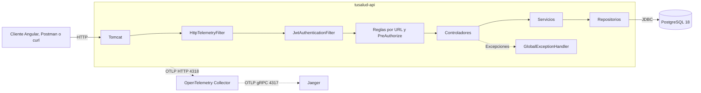
```mermaid
flowchart LR
    Cliente[Cliente Angular, Postman o curl] -->|HTTP| Tomcat
    subgraph API[tusalud-api]
        Tomcat --> Telemetria[HttpTelemetryFilter]
        Telemetria --> JWT[JwtAuthenticationFilter]
        JWT --> Autorizacion[Reglas por URL y PreAuthorize]
        Autorizacion --> Controladores
        Controladores --> Servicios
        Servicios --> Repositorios
        Controladores -.->|Excepciones| Errores[GlobalExceptionHandler]
    end
    Repositorios -->|JDBC| PostgreSQL[(PostgreSQL 18)]
    API -.->|OTLP HTTP 4318| Collector[OpenTelemetry Collector]
    Collector -.->|OTLP gRPC 4317| Jaeger
```

### Diagrama entidad relación

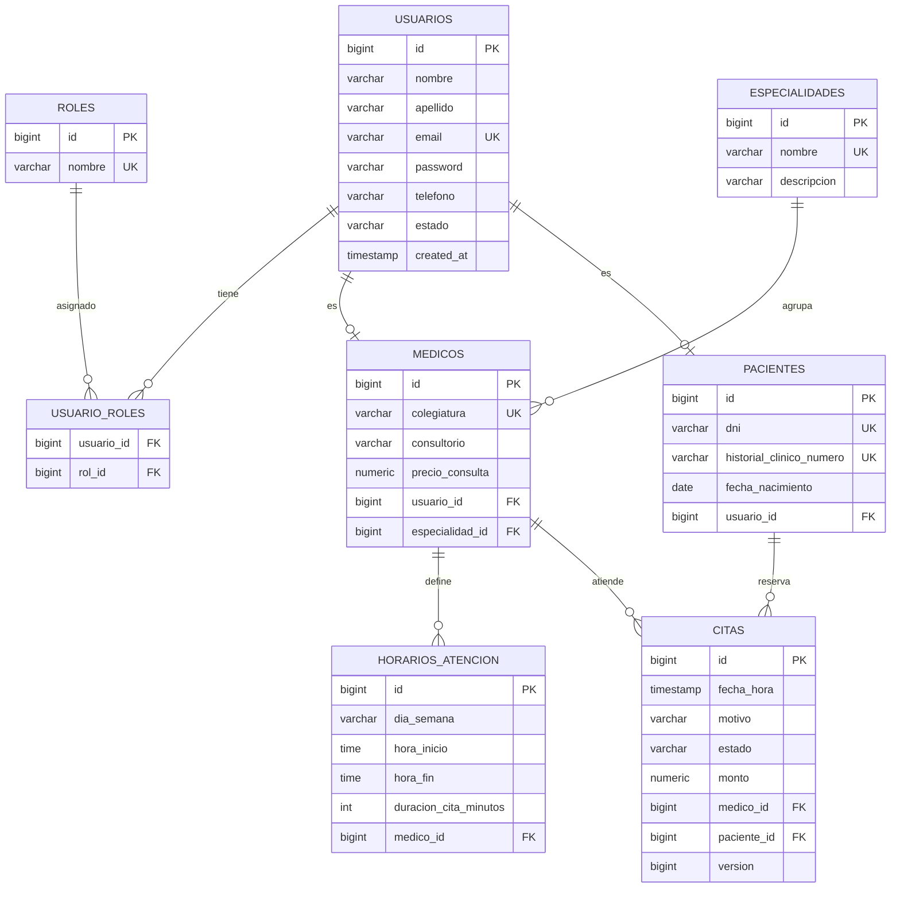
```mermaid
erDiagram
    USUARIOS ||--o{ USUARIO_ROLES : tiene
    ROLES ||--o{ USUARIO_ROLES : asignado
    USUARIOS ||--o| MEDICOS : es
    USUARIOS ||--o| PACIENTES : es
    ESPECIALIDADES ||--o{ MEDICOS : agrupa
    MEDICOS ||--o{ HORARIOS_ATENCION : define
    MEDICOS ||--o{ CITAS : atiende
    PACIENTES ||--o{ CITAS : reserva

    USUARIOS {
        bigint id PK
        varchar nombre
        varchar apellido
        varchar email UK
        varchar password
        varchar telefono
        varchar estado
        timestamp created_at
    }
    ROLES {
        bigint id PK
        varchar nombre UK
    }
    USUARIO_ROLES {
        bigint usuario_id FK
        bigint rol_id FK
    }
    ESPECIALIDADES {
        bigint id PK
        varchar nombre UK
        varchar descripcion
    }
    MEDICOS {
        bigint id PK
        varchar colegiatura UK
        varchar consultorio
        numeric precio_consulta
        bigint usuario_id FK
        bigint especialidad_id FK
    }
    PACIENTES {
        bigint id PK
        varchar dni UK
        varchar historial_clinico_numero UK
        date fecha_nacimiento
        bigint usuario_id FK
    }
    HORARIOS_ATENCION {
        bigint id PK
        varchar dia_semana
        time hora_inicio
        time hora_fin
        int duracion_cita_minutos
        bigint medico_id FK
    }
    CITAS {
        bigint id PK
        timestamp fecha_hora
        varchar motivo
        varchar estado
        numeric monto
        bigint medico_id FK
        bigint paciente_id FK
        bigint version
    }
```

### Diagrama de estados de una cita

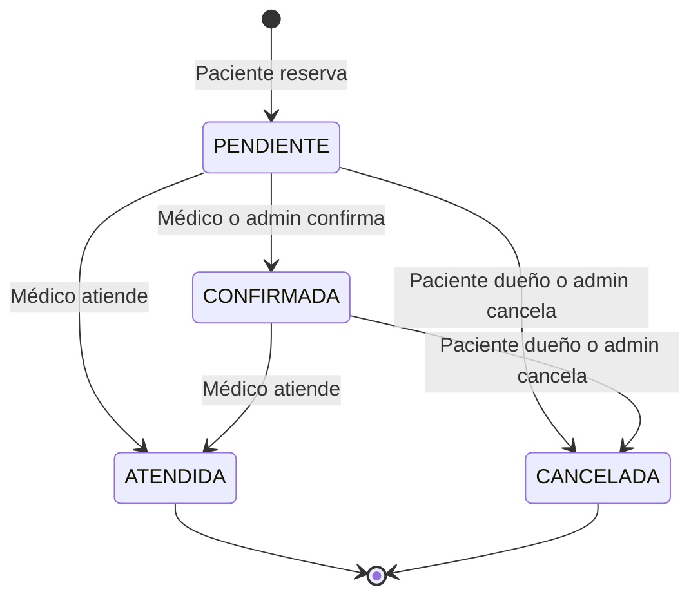
```mermaid
stateDiagram-v2
    [*] --> PENDIENTE: Paciente reserva
    PENDIENTE --> CONFIRMADA: Médico o admin confirma
    PENDIENTE --> ATENDIDA: Médico atiende
    CONFIRMADA --> ATENDIDA: Médico atiende
    PENDIENTE --> CANCELADA: Paciente dueño o admin cancela
    CONFIRMADA --> CANCELADA: Paciente dueño o admin cancela
    ATENDIDA --> [*]
    CANCELADA --> [*]
```

### Autenticación de una petición protegida

Todas las rutas fuera de `/api/v1/auth/**` atraviesan este flujo antes de llegar a su controlador. Los diagramas de cada endpoint parten del punto en que la petición ya está autenticada y autorizada.

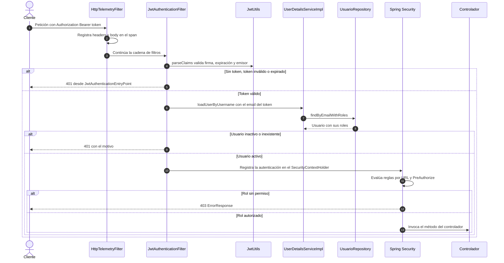
```mermaid
sequenceDiagram
    autonumber
    actor C as Cliente
    participant T as HttpTelemetryFilter
    participant F as JwtAuthenticationFilter
    participant J as JwtUtils
    participant U as UserDetailsServiceImpl
    participant R as UsuarioRepository
    participant S as Spring Security
    participant K as Controlador
    C->>T: Petición con Authorization Bearer token
    T->>T: Registra headers y body en el span
    T->>F: Continúa la cadena de filtros
    F->>J: parseClaims valida firma, expiración y emisor
    alt Sin token, token inválido o expirado
        F-->>C: 401 desde JwtAuthenticationEntryPoint
    else Token válido
        F->>U: loadUserByUsername con el email del token
        U->>R: findByEmailWithRoles
        R-->>U: Usuario con sus roles
        alt Usuario inactivo o inexistente
            F-->>C: 401 con el motivo
        else Usuario activo
            F->>S: Registra la autenticación en el SecurityContextHolder
            S->>S: Evalúa reglas por URL y PreAuthorize
            alt Rol sin permiso
                S-->>C: 403 ErrorResponse
            else Rol autorizado
                S->>K: Invoca el método del controlador
            end
        end
    end
```

### Autenticación

#### POST /api/v1/auth/login

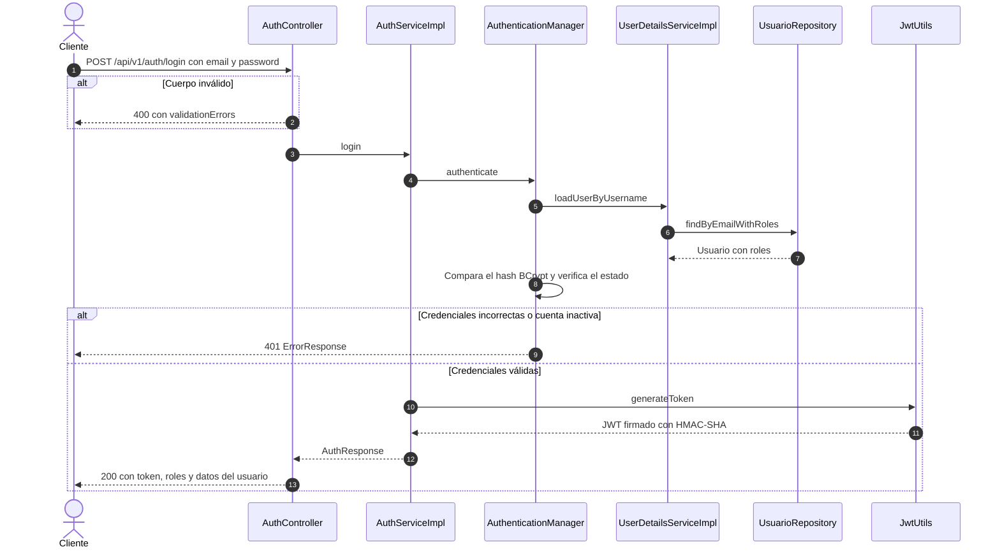
```mermaid
sequenceDiagram
    autonumber
    actor C as Cliente
    participant K as AuthController
    participant S as AuthServiceImpl
    participant M as AuthenticationManager
    participant U as UserDetailsServiceImpl
    participant R as UsuarioRepository
    participant J as JwtUtils
    C->>K: POST /api/v1/auth/login con email y password
    alt Cuerpo inválido
        K-->>C: 400 con validationErrors
    end
    K->>S: login
    S->>M: authenticate
    M->>U: loadUserByUsername
    U->>R: findByEmailWithRoles
    R-->>U: Usuario con roles
    M->>M: Compara el hash BCrypt y verifica el estado
    alt Credenciales incorrectas o cuenta inactiva
        M-->>C: 401 ErrorResponse
    else Credenciales válidas
        S->>J: generateToken
        J-->>S: JWT firmado con HMAC-SHA
        S-->>K: AuthResponse
        K-->>C: 200 con token, roles y datos del usuario
    end
```

#### POST /api/v1/auth/register

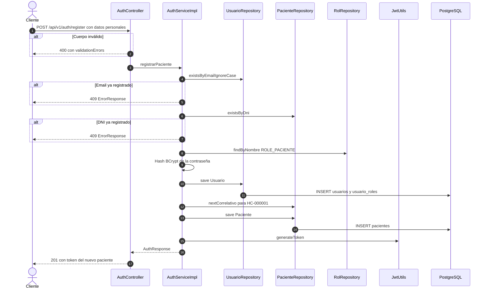
```mermaid
sequenceDiagram
    autonumber
    actor C as Cliente
    participant K as AuthController
    participant S as AuthServiceImpl
    participant UR as UsuarioRepository
    participant PR as PacienteRepository
    participant RR as RolRepository
    participant J as JwtUtils
    participant DB as PostgreSQL
    C->>K: POST /api/v1/auth/register con datos personales
    alt Cuerpo inválido
        K-->>C: 400 con validationErrors
    end
    K->>S: registrarPaciente
    S->>UR: existsByEmailIgnoreCase
    alt Email ya registrado
        S-->>C: 409 ErrorResponse
    end
    S->>PR: existsByDni
    alt DNI ya registrado
        S-->>C: 409 ErrorResponse
    end
    S->>RR: findByNombre ROLE_PACIENTE
    S->>S: Hash BCrypt de la contraseña
    S->>UR: save Usuario
    UR->>DB: INSERT usuarios y usuario_roles
    S->>PR: nextCorrelativo para HC-000001
    S->>PR: save Paciente
    PR->>DB: INSERT pacientes
    S->>J: generateToken
    S-->>K: AuthResponse
    K-->>C: 201 con token del nuevo paciente
```

### Especialidades

#### GET /api/v1/especialidades

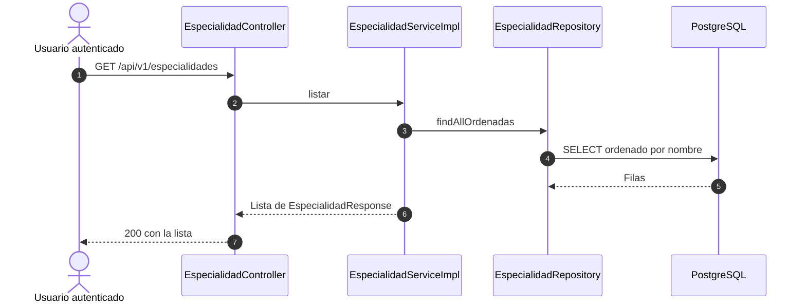
```mermaid
sequenceDiagram
    autonumber
    actor C as Usuario autenticado
    participant K as EspecialidadController
    participant S as EspecialidadServiceImpl
    participant R as EspecialidadRepository
    participant DB as PostgreSQL
    C->>K: GET /api/v1/especialidades
    K->>S: listar
    S->>R: findAllOrdenadas
    R->>DB: SELECT ordenado por nombre
    DB-->>R: Filas
    S-->>K: Lista de EspecialidadResponse
    K-->>C: 200 con la lista
```

#### GET /api/v1/especialidades/{id}

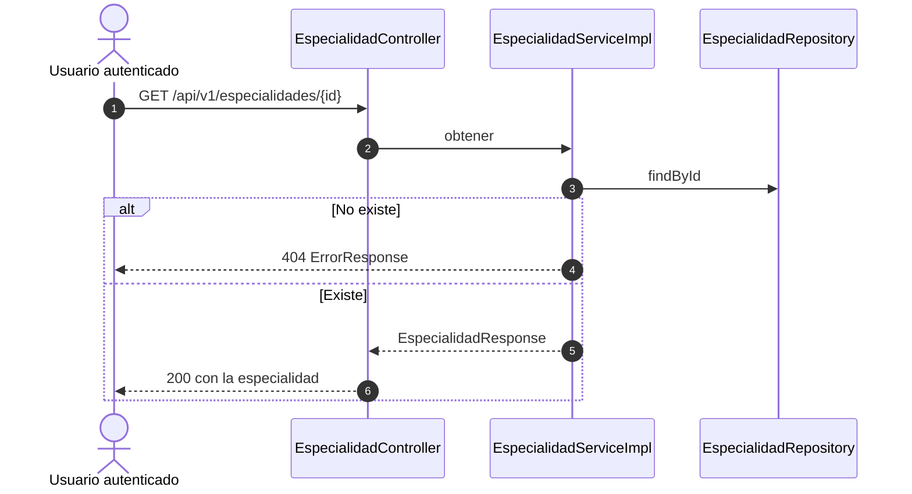
```mermaid
sequenceDiagram
    autonumber
    actor C as Usuario autenticado
    participant K as EspecialidadController
    participant S as EspecialidadServiceImpl
    participant R as EspecialidadRepository
    C->>K: GET /api/v1/especialidades/{id}
    K->>S: obtener
    S->>R: findById
    alt No existe
        S-->>C: 404 ErrorResponse
    else Existe
        S-->>K: EspecialidadResponse
        K-->>C: 200 con la especialidad
    end
```

#### POST /api/v1/especialidades

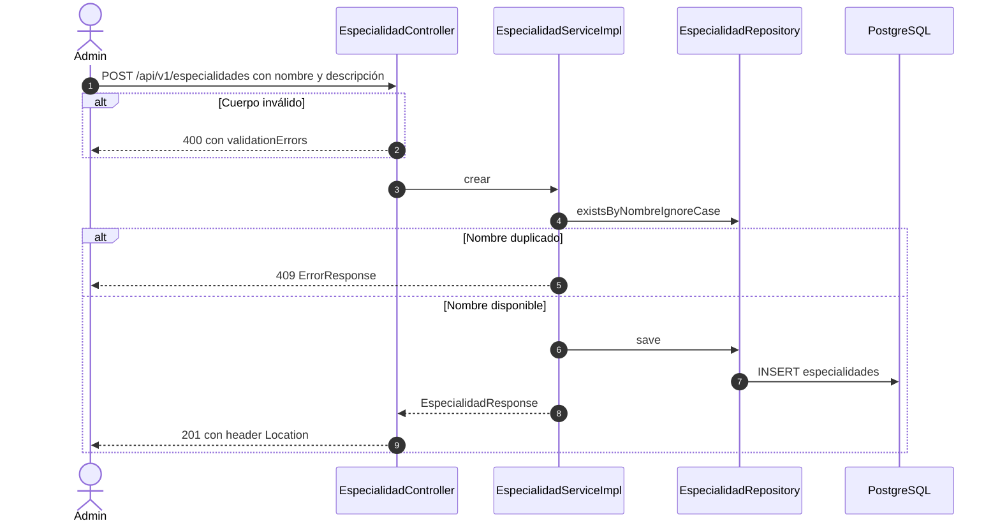
```mermaid
sequenceDiagram
    autonumber
    actor C as Admin
    participant K as EspecialidadController
    participant S as EspecialidadServiceImpl
    participant R as EspecialidadRepository
    participant DB as PostgreSQL
    C->>K: POST /api/v1/especialidades con nombre y descripción
    alt Cuerpo inválido
        K-->>C: 400 con validationErrors
    end
    K->>S: crear
    S->>R: existsByNombreIgnoreCase
    alt Nombre duplicado
        S-->>C: 409 ErrorResponse
    else Nombre disponible
        S->>R: save
        R->>DB: INSERT especialidades
        S-->>K: EspecialidadResponse
        K-->>C: 201 con header Location
    end
```

#### PUT /api/v1/especialidades/{id}

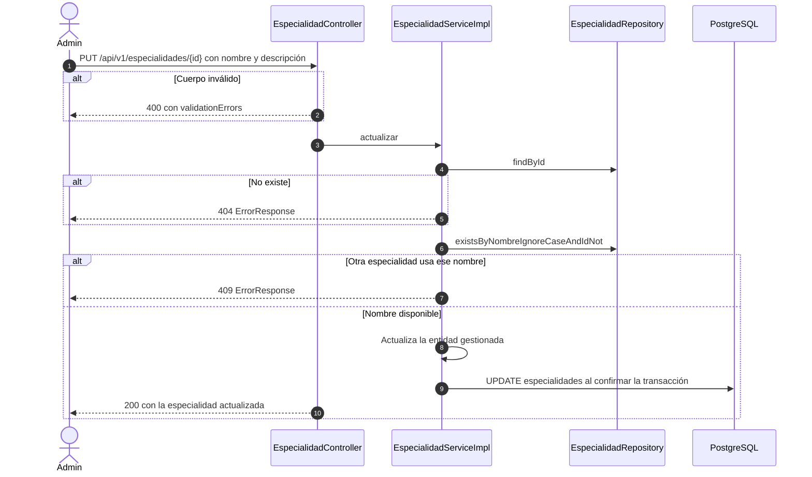
```mermaid
sequenceDiagram
    autonumber
    actor C as Admin
    participant K as EspecialidadController
    participant S as EspecialidadServiceImpl
    participant R as EspecialidadRepository
    participant DB as PostgreSQL
    C->>K: PUT /api/v1/especialidades/{id} con nombre y descripción
    alt Cuerpo inválido
        K-->>C: 400 con validationErrors
    end
    K->>S: actualizar
    S->>R: findById
    alt No existe
        S-->>C: 404 ErrorResponse
    end
    S->>R: existsByNombreIgnoreCaseAndIdNot
    alt Otra especialidad usa ese nombre
        S-->>C: 409 ErrorResponse
    else Nombre disponible
        S->>S: Actualiza la entidad gestionada
        S->>DB: UPDATE especialidades al confirmar la transacción
        K-->>C: 200 con la especialidad actualizada
    end
```

#### DELETE /api/v1/especialidades/{id}

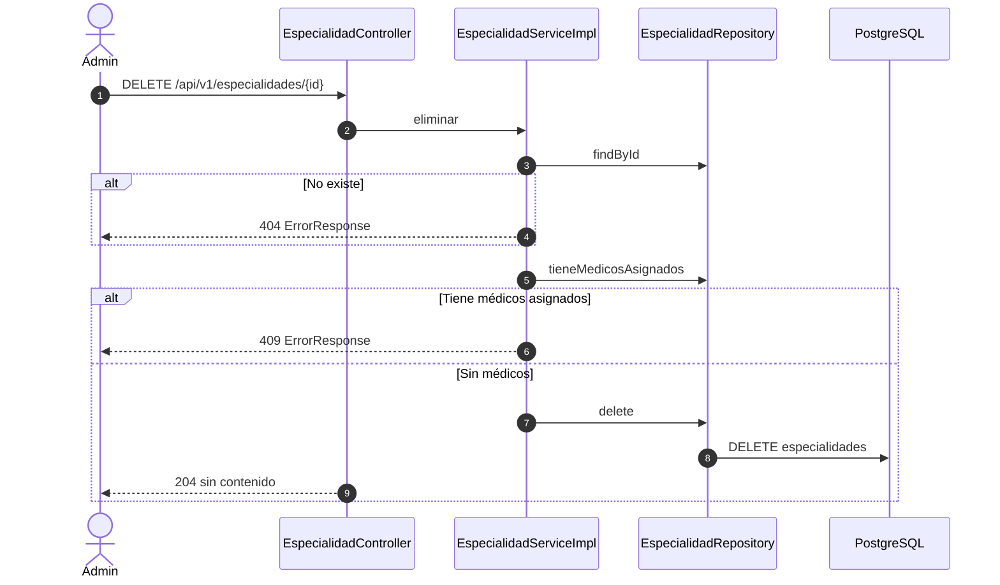
```mermaid
sequenceDiagram
    autonumber
    actor C as Admin
    participant K as EspecialidadController
    participant S as EspecialidadServiceImpl
    participant R as EspecialidadRepository
    participant DB as PostgreSQL
    C->>K: DELETE /api/v1/especialidades/{id}
    K->>S: eliminar
    S->>R: findById
    alt No existe
        S-->>C: 404 ErrorResponse
    end
    S->>R: tieneMedicosAsignados
    alt Tiene médicos asignados
        S-->>C: 409 ErrorResponse
    else Sin médicos
        S->>R: delete
        R->>DB: DELETE especialidades
        K-->>C: 204 sin contenido
    end
```

### Médicos y horarios

#### GET /api/v1/medicos

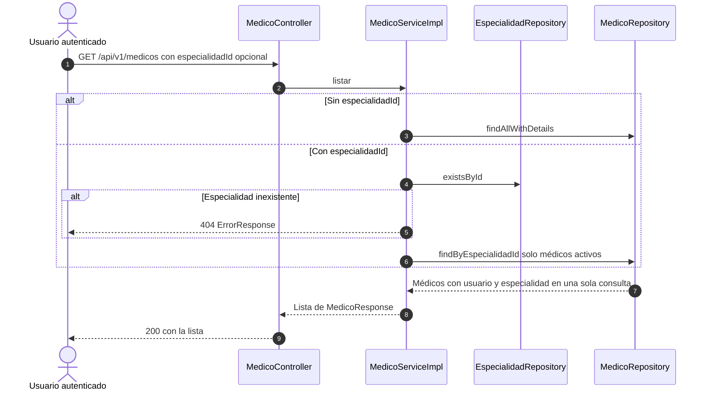
```mermaid
sequenceDiagram
    autonumber
    actor C as Usuario autenticado
    participant K as MedicoController
    participant S as MedicoServiceImpl
    participant ER as EspecialidadRepository
    participant MR as MedicoRepository
    C->>K: GET /api/v1/medicos con especialidadId opcional
    K->>S: listar
    alt Sin especialidadId
        S->>MR: findAllWithDetails
    else Con especialidadId
        S->>ER: existsById
        alt Especialidad inexistente
            S-->>C: 404 ErrorResponse
        end
        S->>MR: findByEspecialidadId solo médicos activos
    end
    MR-->>S: Médicos con usuario y especialidad en una sola consulta
    S-->>K: Lista de MedicoResponse
    K-->>C: 200 con la lista
```

#### GET /api/v1/medicos/{id}

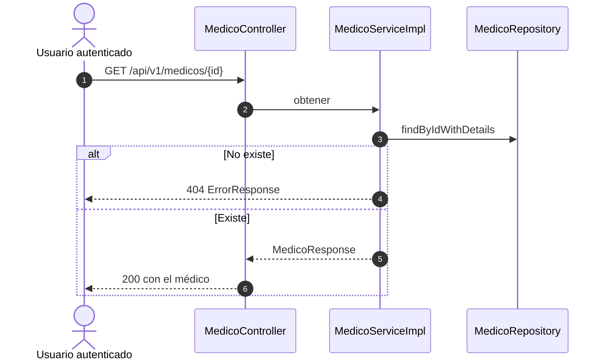
```mermaid
sequenceDiagram
    autonumber
    actor C as Usuario autenticado
    participant K as MedicoController
    participant S as MedicoServiceImpl
    participant MR as MedicoRepository
    C->>K: GET /api/v1/medicos/{id}
    K->>S: obtener
    S->>MR: findByIdWithDetails
    alt No existe
        S-->>C: 404 ErrorResponse
    else Existe
        S-->>K: MedicoResponse
        K-->>C: 200 con el médico
    end
```

#### POST /api/v1/medicos

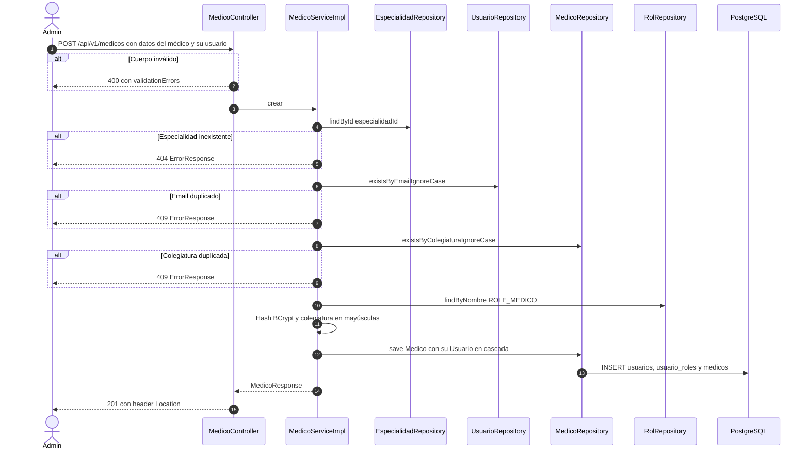
```mermaid
sequenceDiagram
    autonumber
    actor C as Admin
    participant K as MedicoController
    participant S as MedicoServiceImpl
    participant ER as EspecialidadRepository
    participant UR as UsuarioRepository
    participant MR as MedicoRepository
    participant RR as RolRepository
    participant DB as PostgreSQL
    C->>K: POST /api/v1/medicos con datos del médico y su usuario
    alt Cuerpo inválido
        K-->>C: 400 con validationErrors
    end
    K->>S: crear
    S->>ER: findById especialidadId
    alt Especialidad inexistente
        S-->>C: 404 ErrorResponse
    end
    S->>UR: existsByEmailIgnoreCase
    alt Email duplicado
        S-->>C: 409 ErrorResponse
    end
    S->>MR: existsByColegiaturaIgnoreCase
    alt Colegiatura duplicada
        S-->>C: 409 ErrorResponse
    end
    S->>RR: findByNombre ROLE_MEDICO
    S->>S: Hash BCrypt y colegiatura en mayúsculas
    S->>MR: save Medico con su Usuario en cascada
    MR->>DB: INSERT usuarios, usuario_roles y medicos
    S-->>K: MedicoResponse
    K-->>C: 201 con header Location
```

#### GET /api/v1/medicos/{id}/horarios

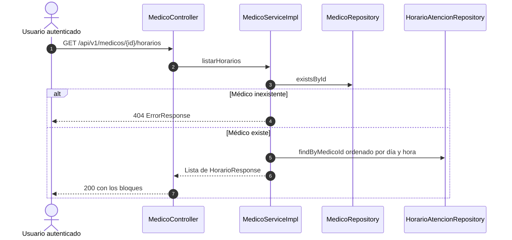
```mermaid
sequenceDiagram
    autonumber
    actor C as Usuario autenticado
    participant K as MedicoController
    participant S as MedicoServiceImpl
    participant MR as MedicoRepository
    participant HR as HorarioAtencionRepository
    C->>K: GET /api/v1/medicos/{id}/horarios
    K->>S: listarHorarios
    S->>MR: existsById
    alt Médico inexistente
        S-->>C: 404 ErrorResponse
    else Médico existe
        S->>HR: findByMedicoId ordenado por día y hora
        S-->>K: Lista de HorarioResponse
        K-->>C: 200 con los bloques
    end
```

#### POST /api/v1/medicos/{id}/horarios

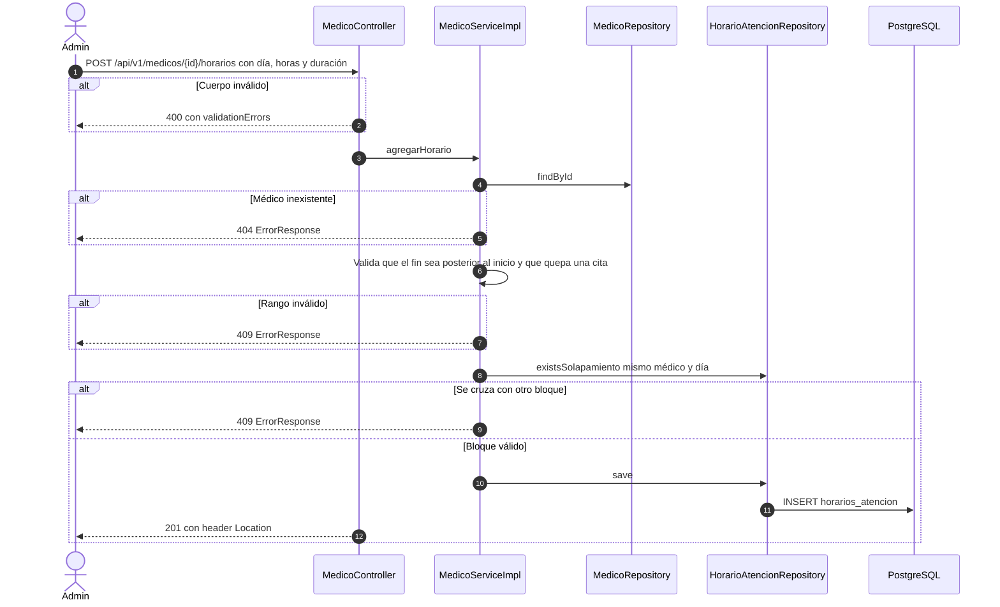
```mermaid
sequenceDiagram
    autonumber
    actor C as Admin
    participant K as MedicoController
    participant S as MedicoServiceImpl
    participant MR as MedicoRepository
    participant HR as HorarioAtencionRepository
    participant DB as PostgreSQL
    C->>K: POST /api/v1/medicos/{id}/horarios con día, horas y duración
    alt Cuerpo inválido
        K-->>C: 400 con validationErrors
    end
    K->>S: agregarHorario
    S->>MR: findById
    alt Médico inexistente
        S-->>C: 404 ErrorResponse
    end
    S->>S: Valida que el fin sea posterior al inicio y que quepa una cita
    alt Rango inválido
        S-->>C: 409 ErrorResponse
    end
    S->>HR: existsSolapamiento mismo médico y día
    alt Se cruza con otro bloque
        S-->>C: 409 ErrorResponse
    else Bloque válido
        S->>HR: save
        HR->>DB: INSERT horarios_atencion
        K-->>C: 201 con header Location
    end
```

#### DELETE /api/v1/medicos/{id}/horarios/{horarioId}

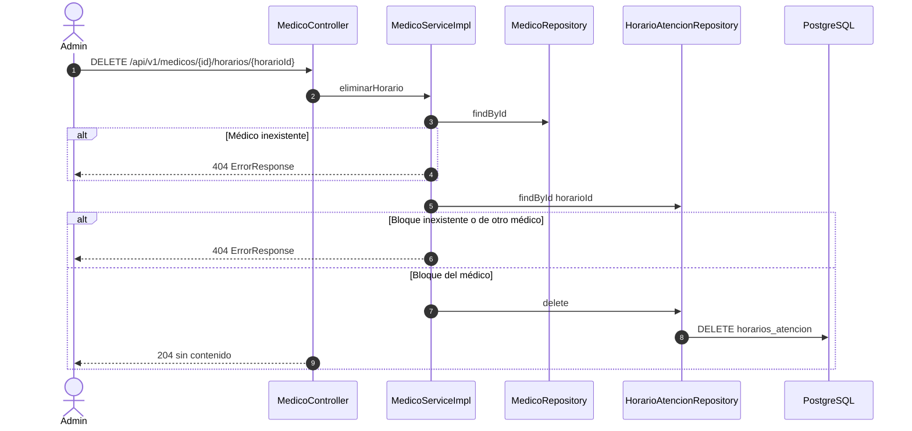
```mermaid
sequenceDiagram
    autonumber
    actor C as Admin
    participant K as MedicoController
    participant S as MedicoServiceImpl
    participant MR as MedicoRepository
    participant HR as HorarioAtencionRepository
    participant DB as PostgreSQL
    C->>K: DELETE /api/v1/medicos/{id}/horarios/{horarioId}
    K->>S: eliminarHorario
    S->>MR: findById
    alt Médico inexistente
        S-->>C: 404 ErrorResponse
    end
    S->>HR: findById horarioId
    alt Bloque inexistente o de otro médico
        S-->>C: 404 ErrorResponse
    else Bloque del médico
        S->>HR: delete
        HR->>DB: DELETE horarios_atencion
        K-->>C: 204 sin contenido
    end
```

#### GET /api/v1/medicos/{id}/disponibilidad

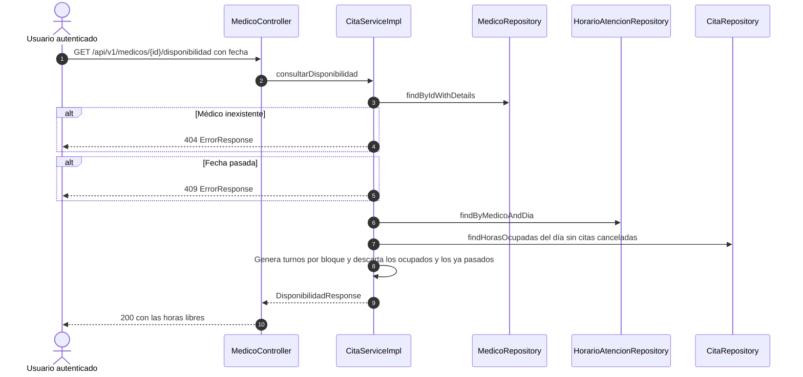
```mermaid
sequenceDiagram
    autonumber
    actor C as Usuario autenticado
    participant K as MedicoController
    participant S as CitaServiceImpl
    participant MR as MedicoRepository
    participant HR as HorarioAtencionRepository
    participant CR as CitaRepository
    C->>K: GET /api/v1/medicos/{id}/disponibilidad con fecha
    K->>S: consultarDisponibilidad
    S->>MR: findByIdWithDetails
    alt Médico inexistente
        S-->>C: 404 ErrorResponse
    end
    alt Fecha pasada
        S-->>C: 409 ErrorResponse
    end
    S->>HR: findByMedicoAndDia
    S->>CR: findHorasOcupadas del día sin citas canceladas
    S->>S: Genera turnos por bloque y descarta los ocupados y los ya pasados
    S-->>K: DisponibilidadResponse
    K-->>C: 200 con las horas libres
```

#### GET /api/v1/medicos/me/agenda

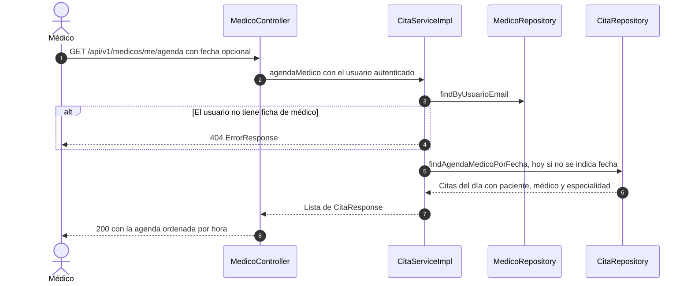
```mermaid
sequenceDiagram
    autonumber
    actor C as Médico
    participant K as MedicoController
    participant S as CitaServiceImpl
    participant MR as MedicoRepository
    participant CR as CitaRepository
    C->>K: GET /api/v1/medicos/me/agenda con fecha opcional
    K->>S: agendaMedico con el usuario autenticado
    S->>MR: findByUsuarioEmail
    alt El usuario no tiene ficha de médico
        S-->>C: 404 ErrorResponse
    end
    S->>CR: findAgendaMedicoPorFecha, hoy si no se indica fecha
    CR-->>S: Citas del día con paciente, médico y especialidad
    S-->>K: Lista de CitaResponse
    K-->>C: 200 con la agenda ordenada por hora
```

### Citas

#### POST /api/v1/citas

Este es el flujo transaccional central del sistema. Todas las operaciones dentro del recuadro forman una sola transacción y cualquier excepción provoca rollback.

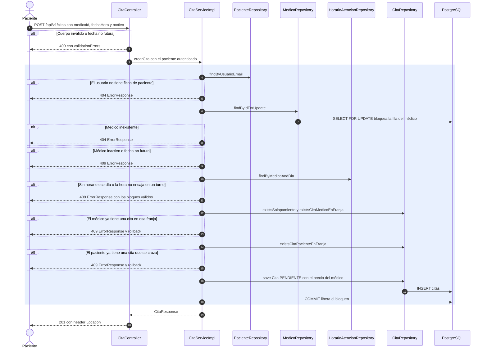
```mermaid
sequenceDiagram
    autonumber
    actor C as Paciente
    participant K as CitaController
    participant S as CitaServiceImpl
    participant PR as PacienteRepository
    participant MR as MedicoRepository
    participant HR as HorarioAtencionRepository
    participant CR as CitaRepository
    participant DB as PostgreSQL
    C->>K: POST /api/v1/citas con medicoId, fechaHora y motivo
    alt Cuerpo inválido o fecha no futura
        K-->>C: 400 con validationErrors
    end
    K->>S: crearCita con el paciente autenticado
    rect rgba(66, 135, 245, 0.12)
        S->>PR: findByUsuarioEmail
        alt El usuario no tiene ficha de paciente
            S-->>C: 404 ErrorResponse
        end
        S->>MR: findByIdForUpdate
        MR->>DB: SELECT FOR UPDATE bloquea la fila del médico
        alt Médico inexistente
            S-->>C: 404 ErrorResponse
        end
        alt Médico inactivo o fecha no futura
            S-->>C: 409 ErrorResponse
        end
        S->>HR: findByMedicoAndDia
        alt Sin horario ese día o la hora no encaja en un turno
            S-->>C: 409 ErrorResponse con los bloques válidos
        end
        S->>CR: existsSolapamiento y existsCitaMedicoEnFranja
        alt El médico ya tiene una cita en esa franja
            S-->>C: 409 ErrorResponse y rollback
        end
        S->>CR: existsCitaPacienteEnFranja
        alt El paciente ya tiene una cita que se cruza
            S-->>C: 409 ErrorResponse y rollback
        end
        S->>CR: save Cita PENDIENTE con el precio del médico
        CR->>DB: INSERT citas
        S->>DB: COMMIT libera el bloqueo
    end
    S-->>K: CitaResponse
    K-->>C: 201 con header Location
```

#### GET /api/v1/citas/mis-citas

```mermaid
sequenceDiagram
    autonumber
    actor C as Paciente
    participant K as CitaController
    participant S as CitaServiceImpl
    participant PR as PacienteRepository
    participant CR as CitaRepository
    C->>K: GET /api/v1/citas/mis-citas con inicio y fin opcionales
    K->>S: listarMisCitas
    S->>PR: findByUsuarioEmail
    alt El usuario no tiene ficha de paciente
        S-->>C: 404 ErrorResponse
    end
    S->>S: Usa hoy y treinta días después si faltan las fechas
    alt Inicio posterior al fin
        S-->>C: 409 ErrorResponse
    else Rango válido
        S->>CR: findByPacienteAndRango ordenado por fecha
        S-->>K: Lista de CitaResponse
        K-->>C: 200 con las citas
    end
```

#### GET /api/v1/citas/{id}

```mermaid
sequenceDiagram
    autonumber
    actor C as Paciente, médico o admin
    participant K as CitaController
    participant S as CitaServiceImpl
    participant CR as CitaRepository
    C->>K: GET /api/v1/citas/{id}
    K->>S: obtenerCita
    S->>CR: findByIdWithDetails
    alt No existe
        S-->>C: 404 ErrorResponse
    end
    S->>S: Verifica que sea admin, el paciente dueño o el médico de la cita
    alt Sin relación con la cita
        S-->>C: 403 ErrorResponse
    else Autorizado
        S-->>K: CitaResponse
        K-->>C: 200 con la cita
    end
```

#### PUT /api/v1/citas/{id}/cancelar

```mermaid
sequenceDiagram
    autonumber
    actor C as Paciente dueño o admin
    participant K as CitaController
    participant S as CitaServiceImpl
    participant CR as CitaRepository
    participant DB as PostgreSQL
    C->>K: PUT /api/v1/citas/{id}/cancelar
    K->>S: cancelarCita
    S->>CR: findByIdWithDetails
    alt No existe
        S-->>C: 404 ErrorResponse
    end
    alt No es el paciente dueño ni admin
        S-->>C: 403 ErrorResponse
    end
    alt Estado distinto de PENDIENTE o CONFIRMADA
        S-->>C: 409 ErrorResponse
    end
    alt Paciente cancelando una cita ya pasada
        S-->>C: 409 ErrorResponse
    else Cancelación válida
        S->>CR: saveAndFlush con estado CANCELADA
        CR->>DB: UPDATE citas con control de version
        K-->>C: 200 con la cita cancelada
    end
```

#### PUT /api/v1/citas/{id}/confirmar

```mermaid
sequenceDiagram
    autonumber
    actor C as Médico de la cita o admin
    participant K as CitaController
    participant S as CitaServiceImpl
    participant CR as CitaRepository
    participant DB as PostgreSQL
    C->>K: PUT /api/v1/citas/{id}/confirmar
    K->>S: confirmarCita
    S->>CR: findByIdWithDetails
    alt No existe
        S-->>C: 404 ErrorResponse
    end
    alt No es el médico de la cita ni admin
        S-->>C: 403 ErrorResponse
    end
    alt Estado distinto de PENDIENTE
        S-->>C: 409 ErrorResponse
    else Confirmación válida
        S->>CR: saveAndFlush con estado CONFIRMADA
        CR->>DB: UPDATE citas con control de version
        K-->>C: 200 con la cita confirmada
    end
```

#### PUT /api/v1/citas/{id}/atender

```mermaid
sequenceDiagram
    autonumber
    actor C as Médico de la cita
    participant K as CitaController
    participant S as CitaServiceImpl
    participant CR as CitaRepository
    participant DB as PostgreSQL
    C->>K: PUT /api/v1/citas/{id}/atender
    K->>S: atenderCita
    S->>CR: findByIdWithDetails
    alt No existe
        S-->>C: 404 ErrorResponse
    end
    alt No es el médico de la cita
        S-->>C: 403 ErrorResponse
    end
    alt Estado distinto de PENDIENTE o CONFIRMADA
        S-->>C: 409 ErrorResponse
    else Atención válida
        S->>CR: saveAndFlush con estado ATENDIDA
        CR->>DB: UPDATE citas con control de version
        K-->>C: 200 con la cita atendida
    end
```

### Auditoría

#### GET /api/v1/admin/auditoria/citas-por-estado

```mermaid
sequenceDiagram
    autonumber
    actor C as Admin
    participant K as AdminController
    participant S as AuditoriaServiceImpl
    participant CR as CitaRepository
    participant DB as PostgreSQL
    C->>K: GET /api/v1/admin/auditoria/citas-por-estado
    K->>S: contarCitasPorEstado
    S->>CR: contarPorEstado
    CR->>DB: SELECT estado y COUNT agrupado por estado
    CR-->>S: CitasPorEstadoResponse creados por la consulta JPQL
    K-->>C: 200 con la cantidad por estado
```

#### GET /api/v1/admin/auditoria/citas

```mermaid
sequenceDiagram
    autonumber
    actor C as Admin
    participant K as AdminController
    participant S as AuditoriaServiceImpl
    participant CR as CitaRepository
    C->>K: GET /api/v1/admin/auditoria/citas con inicio y fin opcionales
    K->>S: listarCitas
    S->>S: Usa treinta días antes y después de hoy si faltan las fechas
    alt Inicio posterior al fin
        S-->>C: 409 ErrorResponse
    else Rango válido
        S->>CR: findAllByRango con médico y paciente en una sola consulta
        S-->>K: Lista de CitaResponse
        K-->>C: 200 con las citas del rango
    end
```

## Manejo de errores

`GlobalExceptionHandler` traduce cada excepción a una respuesta con el mismo formato. Los errores 401 y 403 que produce Spring Security antes de llegar a un controlador usan ese mismo formato.

```json
{
  "timestamp": "2026-10-12T20:45:00",
  "status": 409,
  "error": "Conflict",
  "message": "El médico ya tiene una cita registrada en ese horario",
  "path": "/api/v1/citas"
}
```

| Estado | Causa                                                                                                               |
| ------ | ------------------------------------------------------------------------------------------------------------------- |
| 400    | Datos inválidos, JSON mal formado o parámetros incorrectos. Incluye `validationErrors` con el mensaje de cada campo |
| 401    | Falta el token, el token es inválido o expiró, las credenciales son incorrectas o la cuenta está inactiva           |
| 403    | El rol no tiene permiso o el recurso pertenece a otro usuario                                                       |
| 404    | El recurso no existe                                                                                                |
| 405    | El método HTTP no está soportado en la ruta                                                                         |
| 409    | Conflicto de horario, dato duplicado, transición de estado inválida u otra regla de negocio                         |
| 500    | Error no controlado. El detalle se registra en el log y no se expone al cliente                                     |

## Perfiles y configuración

La configuración de Spring vive en `src/main/resources` y se divide en un archivo base y un archivo por entorno. Todos usan la extensión `.yaml`.

| Archivo                  | Propósito                                                                                  |
| ------------------------ | ------------------------------------------------------------------------------------------ |
| `application.yaml`       | Configuración común: Jackson, JPA, JWT, CORS, springdoc, logging base y perfil activo      |
| `application-local.yaml` | Máquina del desarrollador, con la API en el IDE y PostgreSQL de Docker en `localhost:5432` |
| `application-dev.yaml`   | Entorno de desarrollo compartido o stack de Docker en modo desarrollo                      |
| `application-qa.yaml`    | Entorno de QA                                                                              |
| `application-test.yaml`  | Pruebas automatizadas con H2 en memoria                                                    |
| `application-prod.yaml`  | Producción                                                                                 |

| Perfil  | Base de datos                                                                     | `ddl-auto`    | Logs                                                     | `JWT_SECRET` | Datos de prueba                                      |
| ------- | --------------------------------------------------------------------------------- | ------------- | -------------------------------------------------------- | ------------ | ---------------------------------------------------- |
| `local` | PostgreSQL en `localhost:5432/tusalud` con usuario y clave `postgres` por defecto | `update`      | DEBUG, con SQL, parámetros, Spring Web y Spring Security | Opcional     | Activos                                              |
| `dev`   | PostgreSQL desde `DB_URL`, `DB_USERNAME` y `DB_PASSWORD`, con valores por defecto | `update`      | DEBUG de la aplicación, con SQL y parámetros             | Opcional     | Activos                                              |
| `qa`    | PostgreSQL desde variables de entorno, con valores por defecto                    | `update`      | INFO, sin SQL                                            | Opcional     | Activos                                              |
| `test`  | H2 en memoria en modo PostgreSQL, con consola H2                                  | `create-drop` | DEBUG de la aplicación, SQL en WARN                      | Opcional     | Activos                                              |
| `prod`  | PostgreSQL solo desde variables de entorno, sin valores por defecto               | `update`      | WARN general e INFO de la aplicación                     | Obligatorio  | Inactivos, se activan con `DATA_INITIALIZER_ENABLED` |

Ninguna respuesta de error incluye stacktraces en ningún perfil. En `prod` la consola H2 está deshabilitada y la API no arranca si falta `JWT_SECRET`, `DB_URL`, `DB_USERNAME` o `DB_PASSWORD`.

El proyecto no usa una herramienta de migraciones, por eso `prod` también trabaja con `ddl-auto: update`. Hibernate crea tablas y agrega columnas nuevas, pero no elimina ni renombra columnas ni migra datos. Un cambio incompatible del modelo requiere preparar un script SQL antes de desplegar.

### Selección del perfil

El perfil activo se resuelve en este orden de prioridad:

1. La variable de entorno `SPRING_PROFILES_ACTIVE` o la propiedad `-Dspring.profiles.active` al ejecutar la aplicación.
2. El valor que Maven escribe en `application.yaml` al compilar. El archivo contiene `spring.profiles.active: "@spring.profiles.active@"` y el filtrado de recursos lo reemplaza según el perfil de Maven.

Las pruebas siempre usan el perfil `test` gracias a `@ActiveProfiles("test")`, sin importar el perfil de Maven.

### Perfiles de Maven

El `pom.xml` define los perfiles `local`, `dev`, `qa`, `test` y `prod`. Cada uno deja en el jar el perfil de Spring del mismo nombre, y `local` es el perfil por defecto.

```bash
./mvnw spring-boot:run
./mvnw spring-boot:run -Pdev
./mvnw package -Pprod
```

Al cambiar de perfil de Maven conviene ejecutar `./mvnw clean` antes, para que no se reutilicen recursos filtrados con el perfil anterior.

## Ejecución local

Para trabajar desde el IDE solo hace falta Java 25 y Docker para la base de datos. El Maven Wrapper descarga Maven la primera vez que se ejecuta.

1. Levanta PostgreSQL:

   ```bash
   docker compose up -d postgres
   ```

2. Ejecuta `TusaludApplication` desde el IDE o con el wrapper. El perfil `local` es el predeterminado y se conecta a `jdbc:postgresql://localhost:5432/tusalud` con usuario y clave `postgres`.

   ```bash
   ./mvnw spring-boot:run
   ```

3. Abre `http://localhost:8080/swagger-ui.html` e inicia sesión con alguno de los [usuarios de prueba](#datos-de-prueba).

Para enviar trazas a Jaeger desde el IDE, levanta también `otel-collector` y `jaeger` con Docker Compose y arranca la aplicación con el agente de OpenTelemetry:

```bash
-javaagent:opentelemetry-javaagent.jar -Dotel.service.name=tusalud-api -Dotel.exporter.otlp.endpoint=http://localhost:4318
```

## Docker

### Servicios

| Servicio         | Imagen                                         | Puerto en el host                   |
| ---------------- | ---------------------------------------------- | ----------------------------------- |
| `app`            | `tusalud-api`, construida con el `Dockerfile`  | 8080                                |
| `web`            | `tusalud-web`, construida con `web/Dockerfile` | 4200                                |
| `postgres`       | `postgres:18-alpine`                           | 5432                                |
| `otel-collector` | `otel/opentelemetry-collector-contrib:0.162.0` | 4317 gRPC, 4318 HTTP y 13133 health |
| `jaeger`         | `jaegertracing/jaeger:2.22.0`                  | 16686                               |
| `pgadmin`        | `dpage/pgadmin4`, solo con el perfil `tools`   | 5050                                |

El `Dockerfile` de la API está optimizado en tamaño, arranque y seguridad. La imagen final pesa unos 330 MB:

- Compila con el Maven Wrapper sobre `eclipse-temurin:25-jdk-alpine-3.24` usando una cache de BuildKit para el repositorio de Maven, de modo que las reconstrucciones no vuelven a descargar dependencias.
- Separa el jar de Spring Boot en capas, para que un cambio en el código solo invalide la capa de la aplicación y no la de las dependencias.
- Genera un JRE a medida con `jdeps` y `jlink`. Incluye solo los módulos que usan la aplicación y el agente de OpenTelemetry, y los datos de locale en inglés y español, que la API necesita para nombrar los días. El JRE ocupa unos 95 MB y corre sobre `alpine:3.24`.
- Descarga el agente de OpenTelemetry verificando su SHA-256, de modo que el build falla si el archivo publicado cambia.
- Activa las cabeceras de objetos compactas de Java 25, que reducen el tamaño de cada objeto en memoria.
- Corre con un usuario sin privilegios sobre archivos de solo lectura, y arranca la JVM directamente, sin un shell intermedio, para que reciba las señales de apagado.

El argumento de build `MAVEN_PROFILE` elige el perfil de Maven, `prod` por defecto, y la compilación falla si el `application.yaml` resultante no contiene ese perfil. La imagen define `SPRING_PROFILES_ACTIVE` con el mismo valor. Las opciones adicionales de la JVM se pasan con la variable `JDK_JAVA_OPTIONS`.

### Archivos de Compose

| Archivo            | Rol                                                                                                              |
| ------------------ | ---------------------------------------------------------------------------------------------------------------- |
| `compose.yaml`     | Stack completo en modo producción con PostgreSQL 18, OpenTelemetry Collector, Jaeger, la API y la aplicación web |
| `compose.dev.yaml` | Compila la API con el perfil `dev` y la aplicación web con la configuración `dev`                                |
| `compose.qa.yaml`  | Compila la API con el perfil `qa` y la aplicación web con la configuración `qa`                                  |

### Producción

```bash
docker compose up -d --build
```

`compose.yaml` pasa `JWT_SECRET`, `DB_URL`, `DB_USERNAME` y `DB_PASSWORD` desde `.env`, con valores por defecto que sirven para una máquina local. En un servidor real esos valores deben definirse en `.env`. Para generar un secreto nuevo:

```bash
openssl rand -base64 64 | tr -d '\n'
```

Los datos de prueba están desactivados en producción. Para cargarlos, por ejemplo antes de correr la colección de Postman, defínelos al levantar el stack:

```bash
DATA_INITIALIZER_ENABLED=true docker compose up -d --build
```

### Desarrollo y QA

```bash
docker compose -f compose.yaml -f compose.dev.yaml up -d --build
docker compose -f compose.yaml -f compose.qa.yaml up -d --build
```

Para no repetir `-f` en cada comando, define `COMPOSE_FILE` en `.env` o en la terminal, por ejemplo `COMPOSE_FILE=compose.yaml:compose.dev.yaml`. En Windows el separador es `;`.

### PostgreSQL 18

Desde la versión 18, la imagen oficial guarda los datos en un subdirectorio por versión, `/var/lib/postgresql/18/docker`. Por eso el volumen `postgres-data` se monta en `/var/lib/postgresql` y no en `/var/lib/postgresql/data`. Un volumen creado con PostgreSQL 17 no es compatible: hay que eliminarlo con `docker compose down -v`, lo que borra los datos, o migrarlos con `pg_dump` y `pg_restore`.

### pgAdmin

```bash
docker compose --profile tools up -d
```

pgAdmin queda en `http://localhost:5050` con el usuario `admin@tusalud.com` y la clave `admin`. El servidor `TuSalud (Docker)` ya viene registrado y la clave de la base es `postgres`.

### URLs

| Servicio              | URL                                     |
| --------------------- | --------------------------------------- |
| Aplicación web        | `http://localhost:4200`                 |
| API                   | `http://localhost:8080`                 |
| Swagger UI            | `http://localhost:8080/swagger-ui.html` |
| OpenAPI               | `http://localhost:8080/v3/api-docs`     |
| Jaeger                | `http://localhost:16686`                |
| OTel Collector health | `http://localhost:13133`                |
| pgAdmin               | `http://localhost:5050`                 |

### Comandos útiles

| Comando                                      | Descripción                                            |
| -------------------------------------------- | ------------------------------------------------------ |
| `docker compose ps`                          | Muestra el estado de los contenedores                  |
| `docker compose logs -f app`                 | Sigue los logs de la API                               |
| `docker compose up -d --build app`           | Reconstruye la API después de cambiar código           |
| `docker compose up -d --build --no-deps web` | Reconstruye solo la aplicación web, sin recrear la API |
| `docker compose down`                        | Detiene el stack y conserva los datos                  |
| `docker compose down -v`                     | Detiene el stack y borra los datos                     |

## Aplicación web

La carpeta `web` contiene el frontend, creado con Angular CLI 21.2.26, que es la versión LTS más reciente. El proyecto de Angular se llama `tusalud` y usa componentes standalone, detección de cambios sin zone.js, SCSS, TypeScript en modo estricto y Vitest para las pruebas unitarias.

### Requisitos

- Node.js 20.19, 22.12 o 24, y npm.
- El backend en ejecución en `http://localhost:8080` para consumir la API desde el entorno local.

### Estructura

```text
web/
├── nginx/default.conf.template   Configuración de nginx para la imagen Docker
├── public/                       Archivos estáticos copiados tal cual al build
├── src/
│   ├── app/
│   │   ├── core/                 Guards, interceptores, servicios y modelos de uso global
│   │   ├── features/             Funcionalidades: auth, especialidades, medicos, citas y admin
│   │   ├── layout/               Estructura visual compartida de la aplicación
│   │   ├── shared/               Componentes, directivas y pipes reutilizables
│   │   ├── app.config.ts         Proveedores de router y HttpClient
│   │   └── app.routes.ts         Rutas de la aplicación
│   ├── environments/             Configuración de cada entorno
│   ├── index.html
│   ├── main.ts
│   └── styles.scss
├── angular.json                  Configuraciones de build y de servidor de desarrollo
├── proxy.conf.json               Proxy de /api hacia el backend en el entorno local
└── Dockerfile
```

Las carpetas que todavía no tienen código conservan un archivo `.gitkeep` para que Git las registre.

### Entornos

Cada entorno del frontend coincide con un perfil del backend. El archivo `environment.ts` corresponde a producción y Angular lo reemplaza durante el build según la configuración elegida.

| Configuración | Archivo                | `production` | Optimización | Sourcemaps                           | Hash en nombres |
| ------------- | ---------------------- | ------------ | ------------ | ------------------------------------ | --------------- |
| `local`       | `environment.local.ts` | `false`      | No           | Sí                                   | No              |
| `dev`         | `environment.dev.ts`   | `false`      | No           | Sí                                   | Sí              |
| `qa`          | `environment.qa.ts`    | `true`       | Sí           | Ocultos, sin referencia en el código | Sí              |
| `production`  | `environment.ts`       | `true`       | Sí           | No                                   | Sí              |

Todos los entornos llaman a la API con la ruta relativa `/api/v1`. En local, el servidor de desarrollo de Angular reenvía esas peticiones a `http://localhost:8080` mediante `proxy.conf.json`. En Docker, nginx las reenvía al backend. Así el navegador nunca hace peticiones a otro origen y no depende de CORS.

### Comandos

| Comando               | Descripción                                                              |
| --------------------- | ------------------------------------------------------------------------ |
| `npm start`           | Servidor de desarrollo en `http://localhost:4200` con el entorno `local` |
| `npm run start:dev`   | Servidor de desarrollo con el entorno `dev`                              |
| `npm run build`       | Build de producción                                                      |
| `npm run build:local` | Build con el entorno `local`                                             |
| `npm run build:dev`   | Build con el entorno `dev`                                               |
| `npm run build:qa`    | Build con el entorno `qa`                                                |
| `npm run build:prod`  | Build de producción                                                      |
| `npm test`            | Pruebas unitarias con Vitest                                             |
| `npm run format`      | Formatea el código con Prettier                                          |

Todos los comandos se ejecutan dentro de la carpeta `web`. El build genera el sitio en `web/dist/tusalud/browser`, que contiene `index.html`, los archivos JavaScript y CSS y el contenido de `public`.

### Imagen Docker y Compose

El `Dockerfile` de `web` compila la aplicación con `node:24-alpine`, con una cache de npm entre builds, y sirve el resultado con `nginxinc/nginx-unprivileged:1.30-alpine-slim`, la rama estable de nginx en su variante mínima. El contenedor corre con el usuario `nginx`, sin privilegios de root, escucha en el puerto 8080 y la imagen final pesa unos 30 MB. El argumento de build `BUILD_CONFIGURATION` elige la configuración de Angular y vale `production` por defecto.

La aplicación web forma parte del stack de Compose como servicio `web` y queda disponible en `http://localhost:4200` al levantar cualquier entorno:

```bash
docker compose up -d --build
docker compose -f compose.yaml -f compose.dev.yaml up -d --build
docker compose -f compose.yaml -f compose.qa.yaml up -d --build
```

`compose.yaml` compila el frontend con la configuración `production`, y los archivos de `dev` y `qa` lo compilan con la configuración del mismo nombre. Así el frontend y el backend de un stack siempre corresponden al mismo entorno.

Para reconstruir solo el frontend después de cambiar su código, sin recrear la API:

```bash
docker compose up -d --build --no-deps web
```

nginx cumple estas funciones:

- Devuelve `index.html` para cualquier ruta que no sea un archivo, de modo que las rutas de Angular funcionan al recargar la página.
- Reenvía `/api/` al backend definido en `API_UPSTREAM`, que en Compose es `http://app:8080`. Conserva el header `Host` original con su puerto y agrega `X-Forwarded-Host`, `X-Forwarded-For`, `X-Forwarded-Proto` y `X-Real-IP`, de modo que el header `Location` de las respuestas 201 apunta a `http://localhost:4200`. El nombre del backend se resuelve con el DNS indicado en `NGINX_RESOLVER`, que por defecto es el DNS interno de Docker, `127.0.0.11`, por lo que nginx arranca aunque la API todavía no esté disponible.
- Marca los archivos JavaScript y CSS con hash en el nombre como inmutables durante un año y obliga a revalidar `index.html` en cada visita.
- Sirve los archivos de texto ya comprimidos. El build genera una versión gzip de cada archivo JavaScript, CSS, HTML y SVG, y nginx la entrega directamente con `gzip_static`, sin comprimir en cada petición. Las respuestas de la API se comprimen al vuelo.
- Agrega las cabeceras de seguridad `X-Content-Type-Options`, `X-Frame-Options`, `Referrer-Policy`, `Permissions-Policy` y `Cross-Origin-Opener-Policy`, y oculta la versión de nginx.
- Responde `ok` en `/healthz` sin registrar la petición, y el healthcheck de la imagen usa esa ruta.
- Bloquea la descarga de los archivos `.map`, de modo que los sourcemaps ocultos del build de `qa` no queden expuestos.

Como el navegador solo habla con nginx, la API se consume desde el mismo origen que la aplicación y no depende de CORS. La colección de Postman también puede ejecutarse a través del frontend:

```bash
npx newman run postman/Tusalud.postman_collection.json --env-var baseUrl=http://localhost:4200
```

## Observabilidad

La aplicación se instrumenta con el agente Java de OpenTelemetry, que el `Dockerfile` descarga y carga con `-javaagent`. El agente envía trazas, métricas y logs por OTLP al OpenTelemetry Collector, y el Collector reenvía las trazas a Jaeger.

```text
tusalud-api --OTLP HTTP 4318--> otel-collector --OTLP gRPC 4317--> jaeger
```

En la interfaz de Jaeger, `http://localhost:16686`, selecciona el servicio `tusalud-api`. Solo se guardan las peticiones a `/api/**` y cada traza muestra el recorrido completo de la petición por las capas del sistema:

```text
POST /api/v1/citas
└ JwtAuthenticationFilter.doFilterInternal
  ├ UserDetailsServiceImpl.loadUserByUsername
  │ └ UsuarioRepository.findByEmailWithRoles → SELECT
  └ CitaController.crear
    └ CitaServiceImpl.crearCita
      ├ MedicoRepository.findByIdForUpdate → SELECT ... FOR UPDATE
      ├ CitaRepository.existsSolapamiento → SELECT
      └ CitaRepository.save → INSERT
```

La configuración está repartida en tres lugares:

- `docker/otel-agent/agent.properties` desactiva la instrumentación de Hibernate, que duplicaba cada consulta, activa los spans de controladores y crea spans para el filtro JWT, el `UserDetailsService` y los métodos de las interfaces de servicio.
- `docker/otel-collector/config.yaml` aplica un muestreo de cola que conserva solo las trazas con una petición HTTP a `/api/`. Así se descartan el arranque, la carga de datos iniciales, el healthcheck y Swagger UI. Cada traza aparece en Jaeger unos cinco segundos después de la petición, que es el tiempo que el Collector espera para recibirla completa.
- `HttpTelemetryFilter` agrega al span de cada petición a `/api/**` todos los headers de request y response, en `http.request.header.<nombre>` y `http.response.header.<nombre>`, y los cuerpos completos en `http.request.body` y `http.response.body` junto con sus tamaños. No se enmascara nada: el header `Authorization`, las contraseñas y los tokens quedan visibles tal como viajan. Esta configuración está pensada para depuración y no debe usarse en un entorno compartido con datos reales.

Tomcat agrega los headers `Connection`, `Keep-Alive` y `Transfer-Encoding` al enviar la respuesta, fuera del alcance de la API de servlets, por lo que no aparecen en las trazas.

## Datos de prueba

`DataInitializer` carga datos al arrancar cuando `app.data-initializer.enabled` está activo. Es idempotente: crea cada registro solo si no existe, de modo que reiniciar la aplicación sobre una base persistente no duplica nada.

| Rol      | Nombre          | Email                        | Contraseña     |
| -------- | --------------- | ---------------------------- | -------------- |
| Admin    | Administrador   | `admin@tusalud.com`          | `Admin123!`    |
| Médico   | Luis García     | `dr.garcia@tusalud.com`      | `Medico123!`   |
| Médico   | Carmen López    | `dra.lopez@tusalud.com`      | `Medico123!`   |
| Paciente | Juan Pérez      | `juan.perez@correo.com`      | `Paciente123!` |
| Paciente | María Rodríguez | `maria.rodriguez@correo.com` | `Paciente123!` |

- Especialidades: Cardiología, Pediatría, Medicina General y Dermatología.
- Luis García atiende Cardiología de lunes a viernes de 08:00 a 13:00 con citas de 30 minutos, en el Consultorio 101, por 150.00.
- Carmen López atiende Pediatría de lunes a viernes de 14:00 a 19:00 y los sábados de 08:00 a 12:00 con citas de 30 minutos, en el Consultorio 205, por 120.00.
- Se crean dos citas de ejemplo para el siguiente día hábil: Juan Pérez con Luis García a las 09:00 en estado `PENDIENTE` y María Rodríguez con Carmen López a las 15:00 en estado `CONFIRMADA`.

## Pruebas automatizadas

```bash
./mvnw test
```

Las pruebas usan el perfil `test` con H2 en memoria y no necesitan PostgreSQL ni Docker.

| Clase                               | Qué verifica                                                                                            |
| ----------------------------------- | ------------------------------------------------------------------------------------------------------- |
| `VirtualThreadsTest`                | Que Tomcat atiende las peticiones con virtual threads                                                   |
| `TusaludApplicationTests`           | Que el contexto de Spring arranca                                                                       |
| `CitaRepositoryTest`                | Las consultas JPQL de citas, médicos, horarios y auditoría contra datos reales                          |
| `SecurityIntegrationTest`           | Respuestas 401 y 403, rutas públicas, CORS, contenido del token y login con BCrypt                      |
| `CitaServiceImplTest`               | Reserva de citas, conflictos de horario con rollback, permisos, transiciones de estado y disponibilidad |
| `AuthServiceImplTest`               | Registro de pacientes, duplicados y login                                                               |
| `MedicoEspecialidadServiceImplTest` | Especialidades, alta de médicos y validación de horarios                                                |
| `DataInitializerTest`               | Que los datos iniciales existen y que una segunda ejecución no duplica nada                             |
| `HttpTelemetryFilterTest`           | Que headers y cuerpos llegan completos al span                                                          |

## Flujo de trabajo con Git

Todo el desarrollo ocurre directamente sobre la rama `main`. Cada commit agrupa un bloque de archivos relacionados, de modo que el historial se lea por funcionalidad. Los mensajes siguen el formato de Conventional Commits con la descripción en español, por ejemplo `feat(api): agrega la reserva de citas`.

### Hooks de Git

Los hooks viven versionados en la carpeta `.githooks` y formatean el código antes de cada commit y lo verifican antes de cada push. Para activarlos después de clonar el repositorio:

```bash
git config core.hooksPath .githooks
npm --prefix web ci
```

El segundo comando instala Prettier, que los hooks toman de `web/node_modules`.

| Hook         | Qué hace                                                                                                                                                                                                             |
| ------------ | -------------------------------------------------------------------------------------------------------------------------------------------------------------------------------------------------------------------- |
| `pre-commit` | Formatea los archivos Java preparados con Spotless y el resto con Prettier, y los vuelve a agregar al commit. Prettier ignora los tipos de archivo que no reconoce.                                                  |
| `pre-push`   | Verifica que todo el código Java cumpla el formato de Spotless y que todos los archivos versionados cumplan el formato de Prettier. Si algo no está formateado, cancela el push e indica el comando para corregirlo. |

El hook `pre-commit` vuelve a agregar el archivo completo después de formatearlo. Si un archivo tenía cambios preparados solo en parte, el commit incluirá también los cambios que no estaban preparados.

### Formateadores

| Lenguaje                                        | Herramienta                       | Configuración                                                   |
| ----------------------------------------------- | --------------------------------- | --------------------------------------------------------------- |
| Java                                            | Spotless con palantir-java-format | Plugin `spotless-maven-plugin` en `pom.xml`                     |
| TypeScript, HTML y SCSS del frontend            | Prettier                          | `web/.prettierrc`, con ancho de 100 columnas y comillas simples |
| Markdown, YAML y JSON del resto del repositorio | Prettier                          | `.prettierrc` y `.prettierignore` en la raíz                    |

Para formatear todo el repositorio manualmente:

```bash
./mvnw spotless:apply
git ls-files | xargs web/node_modules/.bin/prettier --write --ignore-unknown
```

El archivo `.gitattributes` fija los finales de línea en LF para todo el repositorio, salvo los scripts `.cmd` y `.bat`, que usan CRLF. Así el formato es idéntico en Windows, Linux y macOS, sin importar el valor de `core.autocrlf` de cada equipo.

## Colección Postman

El archivo `postman/Tusalud.postman_collection.json` es la única colección del proyecto y no necesita un environment. La URL base, los tokens de cada usuario y los identificadores que se capturan durante la ejecución viven como variables de la colección. La variable `baseUrl` apunta a `http://localhost:8080`; para probar otro servidor basta con cambiar su valor. Cada petición incluye pruebas automáticas sobre el código de estado y los campos de la respuesta.

Para usarla en Postman, importa el archivo y ejecuta la colección completa con Run collection. Las carpetas están numeradas y se ejecutan en orden, porque cada una reutiliza los tokens e identificadores que capturan las anteriores:

| Carpeta                   | Contenido                                                                          |
| ------------------------- | ---------------------------------------------------------------------------------- |
| `00 - Autenticación`      | Login de los cinco usuarios de prueba, registro de un paciente y errores 400 y 401 |
| `01 - Especialidades`     | Alta, consulta, actualización, duplicado, acceso sin permiso y eliminación         |
| `02 - Médicos y Horarios` | Listados, alta de médico, bloques de horario, solapamiento y disponibilidad        |
| `03 - Citas (Paciente)`   | Reserva en el primer turno libre, conflictos y acceso a citas ajenas               |
| `04 - Citas (Médico)`     | Agenda, confirmación, atención y transiciones inválidas                            |
| `05 - Cancelación`        | Cancelación de una segunda cita y cancelación repetida                             |
| `06 - Auditoría (Admin)`  | Reportes por estado y por rango, y accesos no permitidos                           |
| `07 - Seguridad`          | Peticiones sin token y con token inválido                                          |

Desde la línea de comandos:

```bash
npx newman run postman/Tusalud.postman_collection.json
```

Para ejecutarla contra otro servidor sin editar el archivo:

```bash
npx newman run postman/Tusalud.postman_collection.json --env-var baseUrl=https://otro-servidor
```

Si los datos de prueba no están cargados, la carpeta de autenticación falla porque no encuentra a los usuarios de prueba. En el perfil `prod` hay que levantar el stack con `DATA_INITIALIZER_ENABLED=true`.

La colección puede ejecutarse varias veces sobre la misma base. Genera emails, DNI, colegiaturas y nombres únicos en cada corrida y calcula la fecha de la cita buscando el primer turno libre, sin depender de identificadores fijos. Cada ejecución deja en la base un paciente, un médico y una especialidad nuevos, además de una cita atendida y otra cancelada.

## Variables de entorno

El archivo `.env.example` documenta todas las variables con valores para desarrollo local. Para personalizarlas, cópialo como `.env`, que está excluido del control de versiones.

```bash
cp .env.example .env
```

| Variable                   | Uso                                                              | Valor por defecto                                     |
| -------------------------- | ---------------------------------------------------------------- | ----------------------------------------------------- |
| `SPRING_PROFILES_ACTIVE`   | Perfil de Spring en tiempo de ejecución                          | El perfil de Maven                                    |
| `DB_URL`                   | URL JDBC de PostgreSQL, obligatoria en `prod`                    | Según el perfil                                       |
| `DB_USERNAME`              | Usuario de PostgreSQL, obligatorio en `prod`                     | `postgres`                                            |
| `DB_PASSWORD`              | Clave de PostgreSQL, obligatoria en `prod`                       | `postgres`                                            |
| `JWT_SECRET`               | Clave HMAC en Base64 de al menos 256 bits, obligatoria en `prod` | Solo fuera de `prod`                                  |
| `JWT_EXPIRATION_MS`        | Vigencia del token en milisegundos                               | `86400000`                                            |
| `CORS_ALLOWED_ORIGINS`     | Orígenes permitidos, separados por comas                         | `http://localhost:4200`                               |
| `DATA_INITIALIZER_ENABLED` | Carga de datos de prueba. Vacío usa el valor del perfil          | Según el perfil                                       |
| `SERVER_PORT`              | Puerto HTTP de la API dentro del contenedor                      | `8080`                                                |
| `JDK_JAVA_OPTIONS`         | Opciones adicionales de la JVM de la API                         | `-XX:MaxRAMPercentage=75 -XX:+ExitOnOutOfMemoryError` |
| `OTEL_SERVICE_NAME`        | Nombre del servicio en las trazas                                | `tusalud-api`                                         |
| `APP_PORT`                 | Puerto de la API en el host                                      | `8080`                                                |
| `WEB_PORT`                 | Puerto de la aplicación web en el host                           | `4200`                                                |
| `POSTGRES_PORT`            | Puerto de PostgreSQL en el host                                  | `5432`                                                |
| `JAEGER_UI_PORT`           | Puerto de la interfaz de Jaeger en el host                       | `16686`                                               |
| `OTEL_GRPC_PORT`           | Puerto OTLP gRPC del Collector en el host                        | `4317`                                                |
| `OTEL_HTTP_PORT`           | Puerto OTLP HTTP del Collector en el host                        | `4318`                                                |
| `OTEL_HEALTH_PORT`         | Puerto del healthcheck del Collector en el host                  | `13133`                                               |
| `PGADMIN_PORT`             | Puerto de pgAdmin en el host                                     | `5050`                                                |
| `PGADMIN_EMAIL`            | Usuario de pgAdmin                                               | `admin@tusalud.com`                                   |
| `PGADMIN_PASSWORD`         | Clave de pgAdmin                                                 | `admin`                                               |
